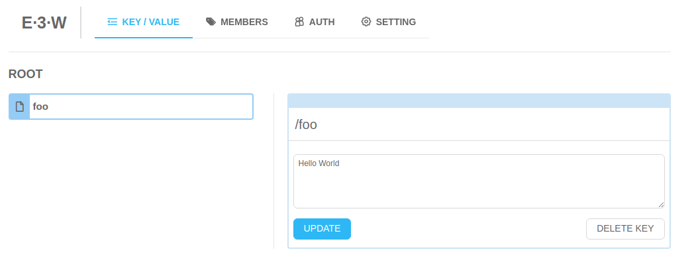
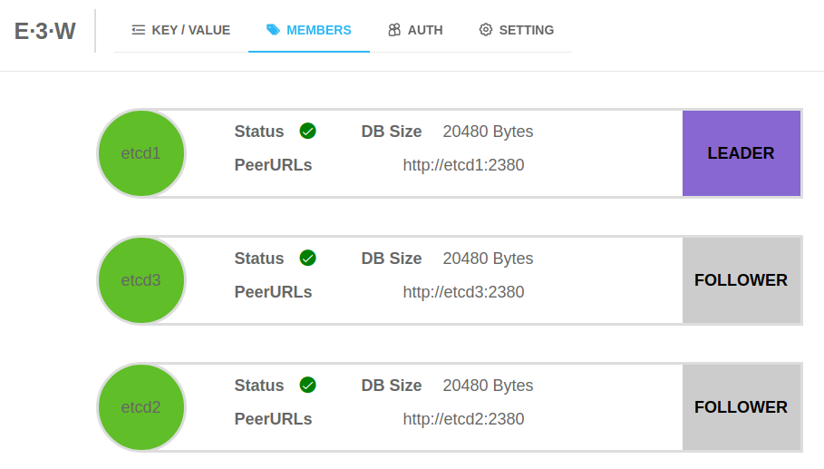
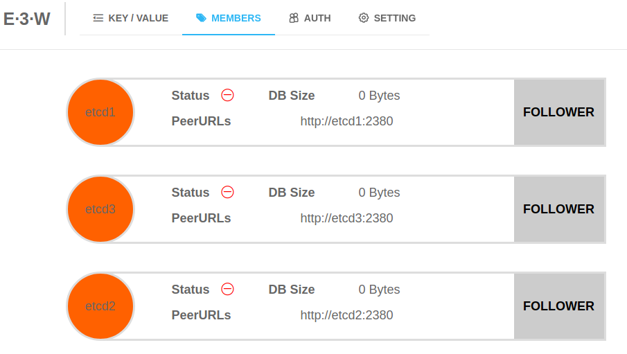
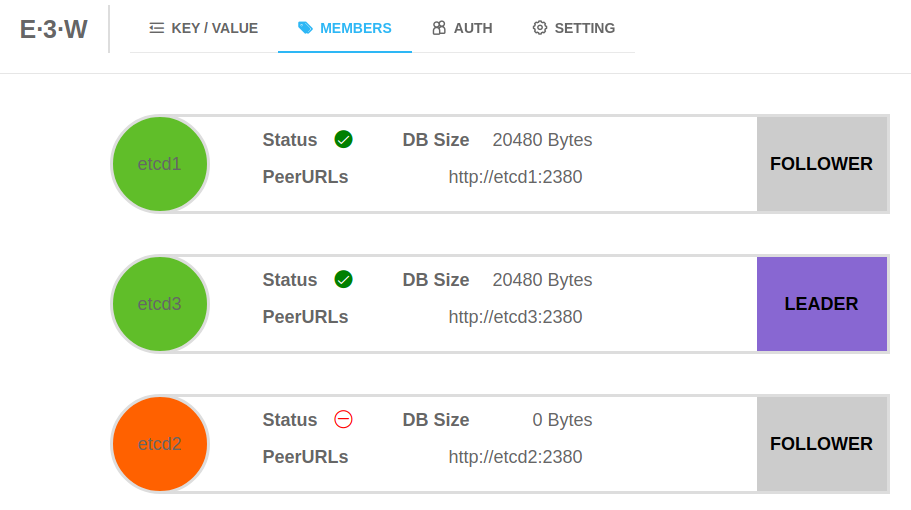
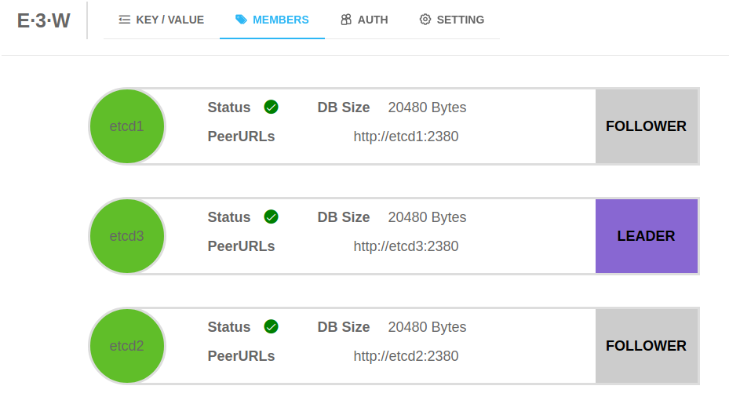

# etcd-demo

This repository aims to test a non-secured local 3-nodes etcd cluster.
It consists in a docker-compose stack with :

- 3 etcd services configured to form a cluster
- 1 etcd GUI to display graphical information about the cluster

The default root key is set to "/root" (cf. config.default.ini)

## Usage

Launch the cluster locally with :

```bash
docker-compose up -d
```

Destroy the cluster with :

```bash
docker-compose down
```

Go to : http://localhost:8080

## "Voting loop" bug reproduction

There is a bug when the leader and a follower go down : https://github.com/etcd-io/etcd/issues/11500
Here are the instructions to reproduce it :

- Launch a cluster :

    ```bash
    docker-compose up -d
    ```

- Insert data either by the UI or by the command line :

    ```bash
    docker-compose exec etcd3 bash -c "etcdctl get / --prefix --keys-only "
    /root

    docker-compose exec etcd3 bash -c 'etcdctl put /root/foo "Hello World"'
    OK
    ```

    

- Find the leader node :
  - either by using etcdctl and checking the `IS LEADER` column in the output of the following command :

    ```bash
    docker-compose exec etcd1 bash -c "etcdctl endpoint status --cluster -w table"
    +-------------------+------------------+---------+---------+-----------+------------+-----------+------------+--------------------+--------+
    |     ENDPOINT      |        ID        | VERSION | DB SIZE | IS LEADER | IS LEARNER | RAFT TERM | RAFT INDEX | RAFT APPLIED INDEX | ERRORS |
    +-------------------+------------------+---------+---------+-----------+------------+-----------+------------+--------------------+--------+
    | http://etcd1:2379 | ade526d28b1f92f7 |   3.4.7 |   20 kB |      true |      false |         2 |          9 |                  9 |        |
    | http://etcd3:2379 | bd388e7810915853 |   3.4.7 |   20 kB |     false |      false |         2 |          9 |                  9 |        |
    | http://etcd2:2379 | d282ac2ce600c1ce |   3.4.7 |   20 kB |     false |      false |         2 |          9 |                  9 |        |
    +-------------------+------------------+---------+---------+-----------+------------+-----------+------------+--------------------+--------+
    ```

  - or by using the GUI at [http://localhost:8080/#/members](http://localhost:8080/#/members)
  

- Stop the leader and one follower :

    ```bash
    docker-compose stop etcd1 etcd2
    ```

The cluster is not responding anymore :

```bash
# Get key
docker-compose exec etcd3 bash -c "etcdctl get foo"
{"level":"warn","ts":"2020-04-30T17:26:52.822Z","caller":"clientv3/retry_interceptor.go:62","msg":"retrying of unary invoker failed","target":"endpoint://client-25121587-d3a9-49b4-a3fe-a63211b55a42/127.0.0.1:2379","attempt":0,"error":"rpc error: code = DeadlineExceeded desc = context deadline exceeded"}
Error: context deadline exceeded

# Member list
docker-compose exec etcd3 bash -c "etcdctl member list"
ade526d28b1f92f7, started, etcd1, http://etcd1:2380, http://etcd1:2379, false
bd388e7810915853, started, etcd3, http://etcd3:2380, http://etcd3:2379, false
d282ac2ce600c1ce, started, etcd2, http://etcd2:2380, http://etcd2:2379, false

# Endpoint status
docker-compose exec etcd3 bash -c "etcdctl endpoint status"
127.0.0.1:2379, bd388e7810915853, 3.4.7, 20 kB, false, false, 3, 12, 12, etcdserver: no leader

# Cluster status
docker-compose exec etcd3 bash -c "etcdctl endpoint status --cluster" 
{"level":"warn","ts":"2020-04-30T17:28:49.453Z","caller":"clientv3/retry_interceptor.go:62","msg":"retrying of unary invoker failed","target":"passthrough:///http://etcd1:2379","attempt":0,"error":"rpc error: code = DeadlineExceeded desc = latest connection error: connection error: desc = \"transport: Error while dialing dial tcp: lookup etcd1 on 127.0.0.11:53: no such host\""}
Failed to get the status of endpoint http://etcd1:2379 (context deadline exceeded)
{"level":"warn","ts":"2020-04-30T17:28:54.456Z","caller":"clientv3/retry_interceptor.go:62","msg":"retrying of unary invoker failed","target":"passthrough:///http://etcd2:2379","attempt":0,"error":"rpc error: code = DeadlineExceeded desc = latest connection error: connection error: desc = \"transport: Error while dialing dial tcp: lookup etcd2 on 127.0.0.11:53: no such host\""}
Failed to get the status of endpoint http://etcd2:2379 (context deadline exceeded)
http://etcd3:2379, bd388e7810915853, 3.4.7, 20 kB, false, false, 3, 12, 12, etcdserver: no leader
```



When looking at the logs, we can see that the remaining node is **stuck in a voting loop** :

```bash
docker-compose logs -f etcd3
[...]
etcd3    | raft2020/04/30 17:20:31 INFO: bd388e7810915853 [term 2] received MsgTimeoutNow from ade526d28b1f92f7 and starts an election to get leadership.
etcd3    | raft2020/04/30 17:20:31 INFO: bd388e7810915853 became candidate at term 3
etcd3    | raft2020/04/30 17:20:31 INFO: bd388e7810915853 received MsgVoteResp from bd388e7810915853 at term 3
etcd3    | raft2020/04/30 17:20:31 INFO: bd388e7810915853 [logterm: 2, index: 11] sent MsgVote request to ade526d28b1f92f7 at term 3
etcd3    | raft2020/04/30 17:20:31 INFO: bd388e7810915853 [logterm: 2, index: 11] sent MsgVote request to d282ac2ce600c1ce at term 3
etcd3    | raft2020/04/30 17:20:31 INFO: raft.node: bd388e7810915853 lost leader ade526d28b1f92f7 at term 3
etcd3    | 2020-04-30 17:20:31.622130 W | rafthttp: lost the TCP streaming connection with peer d282ac2ce600c1ce (stream MsgApp v2 reader)
etcd3    | raft2020/04/30 17:20:31 INFO: bd388e7810915853 received MsgVoteResp from ade526d28b1f92f7 at term 3
etcd3    | raft2020/04/30 17:20:31 INFO: bd388e7810915853 has received 2 MsgVoteResp votes and 0 vote rejections
etcd3    | raft2020/04/30 17:20:31 INFO: bd388e7810915853 became leader at term 3
etcd3    | raft2020/04/30 17:20:31 INFO: raft.node: bd388e7810915853 elected leader bd388e7810915853 at term 3
etcd3    | 2020-04-30 17:20:31.630032 W | rafthttp: lost the TCP streaming connection with peer d282ac2ce600c1ce (stream Message reader)
etcd3    | 2020-04-30 17:20:31.631845 E | rafthttp: failed to dial d282ac2ce600c1ce on stream Message (peer d282ac2ce600c1ce failed to find local node bd388e7810915853)
etcd3    | 2020-04-30 17:20:31.631858 I | rafthttp: peer d282ac2ce600c1ce became inactive (message send to peer failed)
etcd3    | 2020-04-30 17:20:31.642204 W | etcdserver: failed to reach the peerURL(http://etcd2:2380) of member d282ac2ce600c1ce (Get http://etcd2:2380/version: dial tcp 172.19.0.2:2380: connect: connection refused)
etcd3    | 2020-04-30 17:20:31.642236 W | etcdserver: cannot get the version of member d282ac2ce600c1ce (Get http://etcd2:2380/version: dial tcp 172.19.0.2:2380: connect: connection refused)
etcd3    | 2020-04-30 17:20:31.717453 W | rafthttp: lost the TCP streaming connection with peer ade526d28b1f92f7 (stream MsgApp v2 reader)
etcd3    | 2020-04-30 17:20:31.718863 W | rafthttp: lost the TCP streaming connection with peer ade526d28b1f92f7 (stream Message reader)
etcd3    | 2020-04-30 17:20:31.722330 E | rafthttp: failed to dial ade526d28b1f92f7 on stream MsgApp v2 (peer ade526d28b1f92f7 failed to find local node bd388e7810915853)
etcd3    | 2020-04-30 17:20:31.722346 I | rafthttp: peer ade526d28b1f92f7 became inactive (message send to peer failed)
etcd3    | 2020-04-30 17:20:32.028298 W | rafthttp: lost the TCP streaming connection with peer ade526d28b1f92f7 (stream Message writer)
etcd3    | 2020-04-30 17:20:32.030083 W | rafthttp: lost the TCP streaming connection with peer d282ac2ce600c1ce (stream Message writer)
etcd3    | raft2020/04/30 17:20:33 WARN: bd388e7810915853 stepped down to follower since quorum is not active
etcd3    | raft2020/04/30 17:20:33 INFO: bd388e7810915853 became follower at term 3
etcd3    | raft2020/04/30 17:20:33 INFO: raft.node: bd388e7810915853 lost leader bd388e7810915853 at term 3
etcd3    | raft2020/04/30 17:20:34 INFO: bd388e7810915853 is starting a new election at term 3
etcd3    | raft2020/04/30 17:20:34 INFO: bd388e7810915853 became candidate at term 4
etcd3    | raft2020/04/30 17:20:34 INFO: bd388e7810915853 received MsgVoteResp from bd388e7810915853 at term 4
etcd3    | raft2020/04/30 17:20:34 INFO: bd388e7810915853 [logterm: 3, index: 12] sent MsgVote request to ade526d28b1f92f7 at term 4
etcd3    | raft2020/04/30 17:20:34 INFO: bd388e7810915853 [logterm: 3, index: 12] sent MsgVote request to d282ac2ce600c1ce at term 4
etcd3    | raft2020/04/30 17:20:36 INFO: bd388e7810915853 is starting a new election at term 4
etcd3    | raft2020/04/30 17:20:36 INFO: bd388e7810915853 became candidate at term 5
etcd3    | raft2020/04/30 17:20:36 INFO: bd388e7810915853 received MsgVoteResp from bd388e7810915853 at term 5
etcd3    | raft2020/04/30 17:20:36 INFO: bd388e7810915853 [logterm: 3, index: 12] sent MsgVote request to ade526d28b1f92f7 at term 5
etcd3    | raft2020/04/30 17:20:36 INFO: bd388e7810915853 [logterm: 3, index: 12] sent MsgVote request to d282ac2ce600c1ce at term 5
etcd3    | raft2020/04/30 17:20:37 INFO: bd388e7810915853 is starting a new election at term 5
etcd3    | raft2020/04/30 17:20:37 INFO: bd388e7810915853 became candidate at term 6
etcd3    | raft2020/04/30 17:20:37 INFO: bd388e7810915853 received MsgVoteResp from bd388e7810915853 at term 6
etcd3    | raft2020/04/30 17:20:37 INFO: bd388e7810915853 [logterm: 3, index: 12] sent MsgVote request to ade526d28b1f92f7 at term 6
etcd3    | raft2020/04/30 17:20:37 INFO: bd388e7810915853 [logterm: 3, index: 12] sent MsgVote request to d282ac2ce600c1ce at term 6
etcd3    | raft2020/04/30 17:20:38 INFO: bd388e7810915853 is starting a new election at term 6
etcd3    | raft2020/04/30 17:20:38 INFO: bd388e7810915853 became candidate at term 7
etcd3    | raft2020/04/30 17:20:38 INFO: bd388e7810915853 received MsgVoteResp from bd388e7810915853 at term 7
etcd3    | raft2020/04/30 17:20:38 INFO: bd388e7810915853 [logterm: 3, index: 12] sent MsgVote request to ade526d28b1f92f7 at term 7
etcd3    | raft2020/04/30 17:20:38 INFO: bd388e7810915853 [logterm: 3, index: 12] sent MsgVote request to d282ac2ce600c1ce at term 7
etcd3    | raft2020/04/30 17:20:39 INFO: bd388e7810915853 is starting a new election at term 7
etcd3    | raft2020/04/30 17:20:39 INFO: bd388e7810915853 became candidate at term 8
etcd3    | raft2020/04/30 17:20:39 INFO: bd388e7810915853 received MsgVoteResp from bd388e7810915853 at term 8
etcd3    | raft2020/04/30 17:20:39 INFO: bd388e7810915853 [logterm: 3, index: 12] sent MsgVote request to ade526d28b1f92f7 at term 8
etcd3    | raft2020/04/30 17:20:39 INFO: bd388e7810915853 [logterm: 3, index: 12] sent MsgVote request to d282ac2ce600c1ce at term 8
etcd3    | raft2020/04/30 17:20:40 INFO: bd388e7810915853 is starting a new election at term 8
etcd3    | raft2020/04/30 17:20:40 INFO: bd388e7810915853 became candidate at term 9
[...]
```

If we start again one of the other nodes, an election is started, a leader is elected and the cluster is operationnal again :

```bash
docker-composer start etcd1
docker-compose logs -f

[...]
etcd3    | raft2020/04/30 17:30:56 INFO: bd388e7810915853 is starting a new election at term 421
etcd3    | raft2020/04/30 17:30:56 INFO: bd388e7810915853 became candidate at term 422
etcd3    | raft2020/04/30 17:30:56 INFO: bd388e7810915853 received MsgVoteResp from bd388e7810915853 at term 422
etcd3    | raft2020/04/30 17:30:56 INFO: bd388e7810915853 [logterm: 3, index: 12] sent MsgVote request to ade526d28b1f92f7 at term 422
etcd3    | raft2020/04/30 17:30:56 INFO: bd388e7810915853 [logterm: 3, index: 12] sent MsgVote request to d282ac2ce600c1ce at term 422
etcd3    | raft2020/04/30 17:30:56 INFO: bd388e7810915853 received MsgVoteResp from ade526d28b1f92f7 at term 422
etcd3    | raft2020/04/30 17:30:56 INFO: bd388e7810915853 has received 2 MsgVoteResp votes and 0 vote rejections
etcd3    | raft2020/04/30 17:30:56 INFO: bd388e7810915853 became leader at term 422
etcd3    | raft2020/04/30 17:30:56 INFO: raft.node: bd388e7810915853 elected leader bd388e7810915853 at term 422
[...]
etcd1    | 2020-04-30 17:30:55.882995 I | rafthttp: peer bd388e7810915853 became active
etcd1    | 2020-04-30 17:30:55.883016 I | rafthttp: established a TCP streaming connection with peer bd388e7810915853 (stream Message reader)
etcd1    | 2020-04-30 17:30:55.883052 I | rafthttp: established a TCP streaming connection with peer bd388e7810915853 (stream MsgApp v2 reader)
etcd1    | raft2020/04/30 17:30:56 INFO: ade526d28b1f92f7 [term: 3] received a MsgVote message with higher term from bd388e7810915853 [term: 422]
etcd1    | raft2020/04/30 17:30:56 INFO: ade526d28b1f92f7 became follower at term 422
etcd1    | raft2020/04/30 17:30:56 INFO: ade526d28b1f92f7 [logterm: 3, index: 12, vote: 0] cast MsgVote for bd388e7810915853 [logterm: 3, index: 12] at term 422
etcd1    | raft2020/04/30 17:30:56 INFO: raft.node: ade526d28b1f92f7 elected leader bd388e7810915853 at term 422
etcd1    | 2020-04-30 17:30:56.643395 I | etcdserver: published {Name:etcd1 ClientURLs:[http://etcd1:2379]} to cluster 8f2a2ec5c0087dcb
etcd1    | 2020-04-30 17:30:56.643463 I | embed: ready to serve client requests
[...]
```

All interactions are back to normal :

```bash
docker-compose exec etcd3 bash -c "etcdctl get foo"
foo
Hello World
```



If now we start the 3rd node, the cluster is fully operationnal :

```bash
docker-compose start etcd2
```

